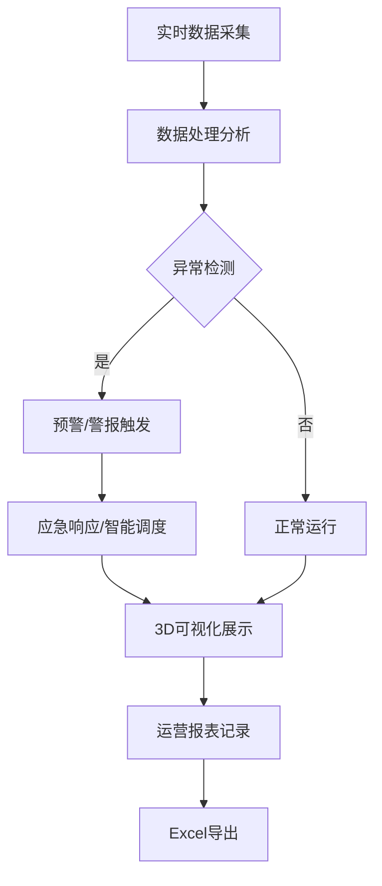

## 1. 产品概述

3D智慧污水处理厂运营调度与环保应急可视化平台，基于数字孪生技术构建污水处理厂全流程3D可视化场景，实现工艺监控、智能调度、设备管理、应急处理、人员安全、审批流程、库存管理和报表导出的一体化运营管理。

- 主要用途：污水处理厂的生产运营调度、环保应急处理、设备运维管理
- 目标用户：污水处理厂运营人员、车间主任、厂长、环保监管人员
- 核心价值：提升运营效率、降低能耗、保障出水达标、实现智能决策

## 2. 核心特性

### 2.1 用户角色

| 角色 | 权限说明 | 核心功能 |
|------|----------|----------|
| 操作员 | 基础操作权限 | 查看实时数据、上报异常、提交参数调整申请 |
| 车间主任 | 中级审批权限 | 审批参数调整、查看报表、调度生产 |
| 厂长 | 高级审批权限 | 最终审批、查看综合报表、制定决策 |
| 环保监控人员 | 只读权限 | 查看出水水质、接收应急警报 |

### 2.2 功能模块

1. **3D工艺可视化**：进水泵房、粗格栅、生化池、二沉池、消毒池、污泥脱水间、中央控制室
2. **水质监测系统**：实时显示COD、氨氮、总磷、流量、液位，24小时趋势曲线
3. **曝气智能控制**：根据溶解氧自动调节风机频率，气泡密度动画展示
4. **智能调度系统**：根据来水负荷自动调度并联生化处理线
5. **设备运维管理**：鼓风机、脱水机运行状态监控、保养预警、工单生成
6. **环保应急系统**：出水超标应急投加、警报推送、红色流向箭头
7. **人员安全监测**：危险区域入侵报警、人员信息显示
8. **三级审批流程**：工艺参数调整电子审批流
9. **药剂库存管理**：库存预警、采购申请、可维持天数计算
10. **运营报表导出**：按日期导出Excel日报

### 2.3 页面详情

| 页面名称 | 模块名称 | 功能描述 |
|-----------|-------------|---------------------|
| 主页面-3D场景 | 3D工艺流程 | 展示全厂3D模型，各工艺单元实时数据悬浮显示，支持旋转、缩放、点击交互 |
| 主页面-3D场景 | 水质监测面板 | 各工艺段进出水水质参数实时展示，颜色编码表示达标状态 |
| 主页面-3D场景 | 趋势曲线弹窗 | 点击工艺单元弹出近24小时水质参数趋势曲线图 |
| 主页面-3D场景 | 曝气动画 | 生化池曝气气泡密度随溶解氧动态变化，DO<1mg/L区域变红 |
| 主页面-3D场景 | 调度路径可视化 | 备用线切换时显示绿色虚线流动路径 |
| 主页面-3D场景 | 应急流向箭头 | 应急投加时显示红色流向箭头标注管道走向 |
| 主页面-3D场景 | 设备状态标识 | 超保养阈值设备边框变橙，点击查看详情 |
| 主页面-3D场景 | 人员安全标识 | 危险区域人员闪烁报警，头顶显示姓名工种 |
| 右侧面板-调度大屏 | 审批流程展示 | 三级审批流程进度条展示，状态实时更新 |
| 右侧面板-调度大屏 | 警报中心 | 实时警报列表，按级别分类显示 |
| 右侧面板-调度大屏 | 设备运维 | 设备运行状态、累计时长、工单列表 |
| 右侧面板-调度大屏 | 库存管理 | 药剂库存、安全阈值、可维持天数、采购申请 |
| 顶部工具栏 | 报表导出 | 日期选择器，导出Excel运营日报 |
| 顶部工具栏 | 视图切换 | 不同工艺区域快速定位 |

## 3. 核心流程

### 3.1 智能调度流程
来水水量及污染物负荷实时监测 → 系统分析各生化线处理能力 → 自动分配处理负荷 → 若某线超负荷 → 自动切换至备用线 → 3D场景显示绿色虚线切换路径 → 更新调度记录

### 3.2 应急处理流程
出水水质在线监测 → 检测到超标 → 自动启动应急投加系统 → 3D显示红色流向箭头 → 推送警报至环保监控中心 → 记录应急处理过程 → 水质恢复正常后关闭应急系统

### 3.3 参数审批流程
操作员提交调整申请 → 系统推送至车间主任 → 车间主任审批（通过/驳回）→ 若通过推送至厂长 → 厂长最终审批 → 审批通过自动执行参数调整 → 调度大屏展示全流程进度

### 3.4 库存管理流程
药剂库存实时监测 → 低于安全阈值 → 自动计算可维持天数 → 生成采购申请单 → 通知采购人员 → 库存补充后更新状态

## 4. 用户界面设计

### 4.1 设计风格
- **主色调**：深海蓝（#0a1628）作为背景主色，体现工业科技感
- **辅助色**：科技青（#00d4ff）用于正常状态和数据展示，警示橙（#ff9500）用于设备预警，危险红（#ff3b30）用于警报和超标，安全绿（#34c759）用于正常和切换路径
- **字体**：主标题使用 Orbitron（科技感字体），正文使用 Rajdhani（清晰易读的工业字体）
- **布局**：左侧3D场景为主视图（占75%宽度），右侧信息面板（占25%宽度），顶部工具栏
- **按钮风格**：玻璃拟态风格，圆角8px，悬停发光效果
- **图标**：使用 lucide-react 图标库，线条风格

### 4.2 页面设计概述

| 页面名称 | 模块名称 | UI元素 |
|-----------|-------------|-------------|
| 主页面-3D场景 | 3D工艺流程 | 深色工业风背景、霓虹光效边缘、悬浮数据卡片、动态气泡效果、流体管道动画 |
| 右侧面板-调度大屏 | 审批流程 | 时间线式进度展示、状态徽章、审批人头像、审批时间 |
| 右侧面板-调度大屏 | 警报中心 | 分级颜色编码、闪烁动画、倒计时、处理按钮 |
| 右侧面板-调度大屏 | 设备运维 | 设备卡片、进度条（运行时长）、状态指示灯、工单快捷按钮 |
| 右侧面板-调度大屏 | 库存管理 | 库存仪表盘、可维持天数进度环、阈值线、采购按钮 |
| 顶部工具栏 | 工具栏 | 玻璃拟态背景、日期选择器、导出按钮、视图切换下拉菜单、系统时间 |

### 4.3 响应式
- 桌面端优先设计（1920×1080及以上）
- 右侧面板可折叠收起，3D场景自适应全屏
- 支持键盘快捷键控制3D视角
- 触摸设备支持手势缩放旋转

### 4.4 3D场景指导
- **环境氛围**：工业厂房内部，柔和环境光配区域重点照明，水面反射效果
- **光照设置**：主光源模拟厂房顶灯，各工艺单元有自发光效果，夜间模式可选
- **相机设置**：默认透视相机，视角可环绕全厂，支持预设视角快速切换
- **交互方式**：OrbitControls控制旋转缩放，点击模型选中，双击放大定位
- **动画效果**：气泡粒子系统、管道流体流动、设备运转动画、警报闪烁效果
- **后处理**：Bloom辉光效果（突出重点设备和警报）、轻微抗锯齿
- **性能优化**：实例化渲染重复元素、LOD层级细节、按需渲染
