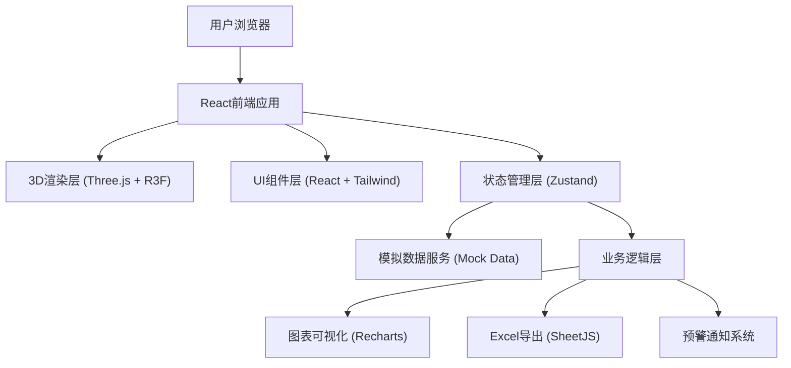

## 1. 架构设计



## 2. 技术描述

- **前端框架**：React@18 + TypeScript + Vite@5
- **3D引擎**：three@^0.160.0 + @react-three/fiber@^8.15.0 + @react-three/drei@^9.92.0 + @react-three/postprocessing@^2.15.0
- **样式方案**：tailwindcss@^3.4.0
- **状态管理**：zustand@^4.4.0
- **图表库**：recharts@^2.10.0
- **Excel导出**：xlsx@^0.18.5
- **图标库**：lucide-react@^0.294.0
- **路由**：react-router-dom@^6.20.0
- **初始化工具**：vite-init
- **后端**：无（纯前端，使用Mock数据模拟实时运行）
- **数据库**：无（使用localStorage持久化配置和历史记录）

## 3. 目录结构

```
src/
├── components/          # React组件
│   ├── scene/          # 3D场景组件
│   │   ├── PlantScene.tsx      # 主场景
│   │   ├── ProcessUnits.tsx    # 工艺单元模型
│   │   ├── AerationSystem.tsx  # 曝气系统
│   │   ├── PipelineFlow.tsx    # 管道流体
│   │   ├── Personnel.tsx       # 人员模型
│   │   └── WaterQualityTag.tsx # 水质标签
│   ├── ui/             # UI组件
│   │   ├── TopToolbar.tsx      # 顶部工具栏
│   │   ├── RightPanel.tsx      # 右侧面板
│   │   ├── AlertCenter.tsx     # 警报中心
│   │   ├── ApprovalFlow.tsx    # 审批流程
│   │   ├── EquipmentPanel.tsx  # 设备面板
│   │   ├── InventoryPanel.tsx  # 库存面板
│   │   ├── TrendChart.tsx      # 趋势曲线
│   │   └── GlassCard.tsx       # 玻璃卡片
│   └── common/         # 通用组件
├── store/              # Zustand状态管理
│   ├── usePlantStore.ts       # 工厂运行状态
│   ├── useAlertStore.ts       # 警报状态
│   ├── useApprovalStore.ts    # 审批状态
│   └── useInventoryStore.ts   # 库存状态
├── hooks/              # 自定义Hooks
│   ├── useWaterQuality.ts     # 水质数据
│   ├── useAerationControl.ts  # 曝气控制
│   ├── useDispatchSystem.ts   # 调度系统
│   └── useSimulation.ts       # 模拟运行
├── utils/              # 工具函数
│   ├── excelExporter.ts       # Excel导出
│   ├── colorUtils.ts          # 颜色工具
│   └── formatters.ts          # 格式化工具
├── types/              # TypeScript类型定义
│   └── index.ts
├── data/               # Mock数据
│   ├── initialData.ts         # 初始数据
│   └── simulationConfig.ts    # 模拟配置
├── pages/              # 页面
│   └── Dashboard.tsx          # 主仪表盘
├── App.tsx
├── main.tsx
└── index.css
```

## 4. 核心数据类型定义

```typescript
// 水质参数
interface WaterQuality {
  cod: number;        // COD mg/L
  nh3n: number;       // 氨氮 mg/L
  tp: number;         // 总磷 mg/L
  flow: number;       // 流量 m³/h
  level: number;      // 液位 m
  do?: number;        // 溶解氧 mg/L (生化池)
}

// 工艺单元
interface ProcessUnit {
  id: string;
  name: string;
  type: 'inlet' | 'grille' | 'biological' | 'sediment' | 'disinfection' | 'dewatering' | 'control';
  position: [number, number, number];
  inletWater: WaterQuality;
  outletWater: WaterQuality;
  status: 'normal' | 'warning' | 'alarm';
  trendData: WaterQuality[];  // 近24小时数据
}

// 设备
interface Equipment {
  id: string;
  name: string;
  type: 'blower' | 'dewaterer' | 'pump';
  runHours: number;
  maintenanceThreshold: number;
  status: 'running' | 'standby' | 'maintenance';
  frequency?: number;  // 风机频率 Hz
}

// 警报
interface Alert {
  id: string;
  type: 'water_quality' | 'equipment' | 'safety' | 'emergency';
  level: 'info' | 'warning' | 'critical';
  message: string;
  timestamp: Date;
  acknowledged: boolean;
  unitId?: string;
}

// 审批流程
interface ApprovalRequest {
  id: string;
  parameter: string;
  currentValue: number;
  requestedValue: number;
  unit: string;
  reason: string;
  applicant: string;
  status: 'pending_operator' | 'pending_director' | 'pending_manager' | 'approved' | 'rejected';
  operatorApproval?: { approved: boolean; comment: string; time: Date };
  directorApproval?: { approved: boolean; comment: string; time: Date };
  managerApproval?: { approved: boolean; comment: string; time: Date };
  createdAt: Date;
}

// 药剂库存
interface ChemicalInventory {
  id: string;
  name: string;
  currentStock: number;
  safetyThreshold: number;
  dailyConsumption: number;
  unit: string;
  purchaseRequest?: {
    id: string;
    quantity: number;
    createdAt: Date;
    status: 'pending' | 'ordered' | 'received';
  };
}

// 人员
interface Personnel {
  id: string;
  name: string;
  role: string;
  position: [number, number, number];
  inDangerZone: boolean;
  zoneName?: string;
}

// 生化处理线
interface TreatmentLine {
  id: string;
  name: string;
  capacity: number;        // 处理能力 m³/h
  currentLoad: number;     // 当前负荷 %
  isActive: boolean;
  isBackup: boolean;
  isOverloaded: boolean;
}
```

## 5. 核心功能实现要点

### 5.1 3D场景渲染
- 使用 `@react-three/fiber` 声明式构建3D场景
- 使用 `@react-three/drei` 提供的 `OrbitControls`, `Float`, `Text` 等辅助组件
- 使用 `@react-three/postprocessing` 实现Bloom辉光效果
- 工艺单元使用基础几何体组合构建（Box, Cylinder, Sphere等）
- 气泡使用 `InstancedMesh` 实现高性能粒子渲染

### 5.2 曝气控制系统
- 实时监测生化池溶解氧(DO)
- PID控制算法：当DO < 2mg/L时增加风机频率，DO > 4mg/L时降低
- 气泡密度与DO成反比，DO越低气泡越密集
- DO < 1mg/L时触发警报，池体材质变红并闪烁

### 5.3 智能调度系统
- 实时监测进水流量和污染物负荷
- 计算各处理线负荷率 = 当前流量 / 设计容量 × 100%
- 当某条线负荷 > 90% 持续5分钟，自动启用备用线
- 切换路径使用虚线管状几何体 + 纹理偏移动画实现绿色流动效果

### 5.4 应急处理系统
- 出水水质超标时（COD > 50, 氨氮 > 5, 总磷 > 0.5）
- 自动启动应急投加泵
- 应急管道使用红色箭头 + 流动纹理动画
- 推送警报至右侧面板，声音提醒（可选）

### 5.5 三级审批流程
- 状态机管理审批进度
- 时间线可视化展示审批节点
- 模拟自动审批（每级30秒后自动通过）
- 审批通过后自动更新参数值

### 5.6 Excel导出
- 使用 `xlsx` 库生成Excel文件
- 包含：工艺段处理量统计表、出水达标率、能耗统计
- 支持按日期选择导出范围
- 文件命名：污水处理厂运营日报_YYYY-MM-DD.xlsx

## 6. 模拟数据生成

系统使用定时器模拟实时数据更新（每2秒更新一次）：
- 水质参数在正常范围内随机波动
- 随机触发警报事件（低概率）
- 设备运行时长累计
- 库存每日消耗计算
- 审批流程自动推进

所有数据保存在 Zustand store 中，支持热更新和时间旅行调试。
